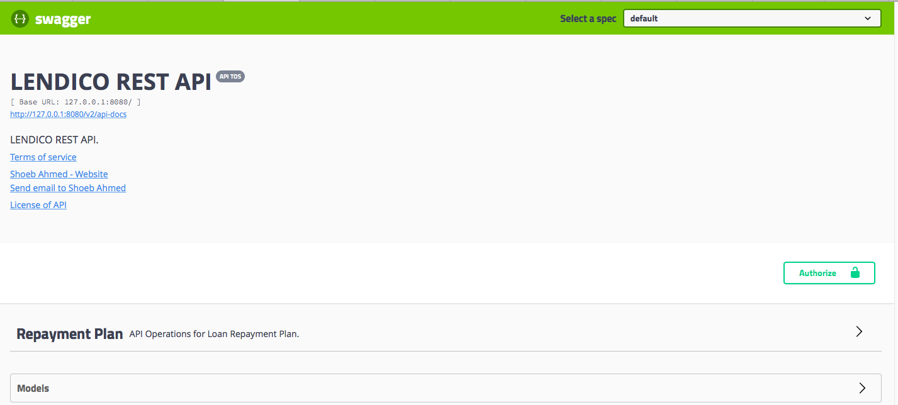
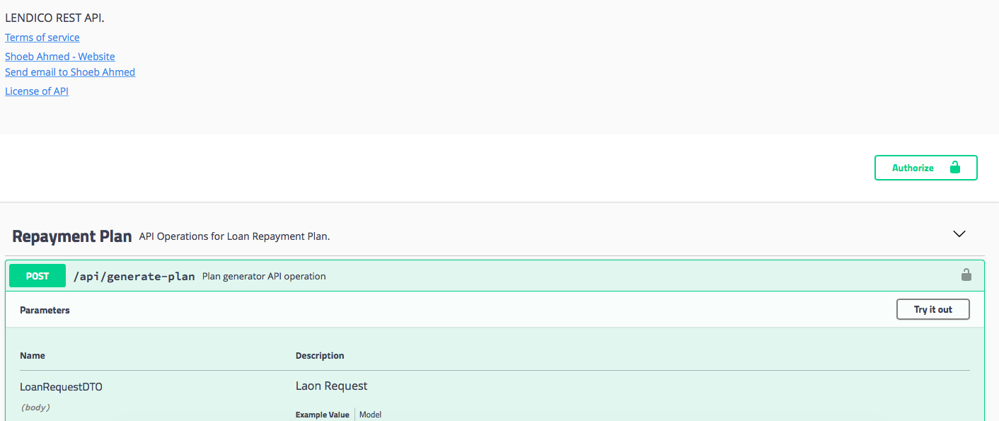
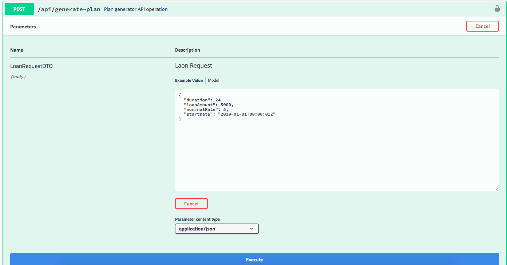
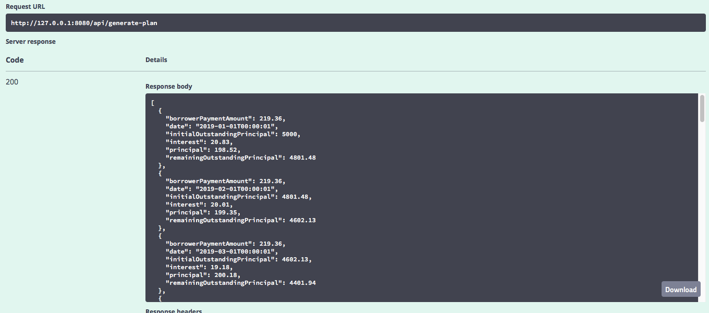

# Lendico - Assignment

This assignment is prepared for Lendico Coding Challange. API for Loan Repayment Plan Generator is delivered as a part of this assigment. I have used Eclipse on Mac to build this micro service and docker to run this application. All details is provided in this readme.

### Contents
  1. [Design Consideration](#design-consideration)
  2. [Assumption](#assumption)
  3. [Ecosystem and Library](#ecosystem-and-library) 
  4. [How to build and run Lendico μS](#ecosystem-and-library)
 

### [Design Consideration](#design-consideration)
  I have used Spring Boot Microservice's to build Plan generator API. Docker is used for local development and also for deployment. Swagger is incorporated to quickly verify this application. Google Code style plugin for Eclipse is used to format code while developing.

  ##### Unit and Integration Testing
    MockMvc is used for Unit and Integration Testing. JUnit version 5 is used to test Plan Generator μS. Unit 
    testing covers basic API  testing with JSON. Integration testing is used to verify basic and 
    additional requirements of this assignment.

### [Assumption](#assumption)
    I have assumed to use basic Spring Boot to build this assignment. Due to time consideration, I was 
    unable to write comments in Java file, but named variable and function to conveys its purpose. 
    Lendico μS runs on port 8080

### [Ecosystem and Library](#ecosystem-and-library)
  Java 8
  Eclipse IDE on Mac.
  Maven to build this Lendico μS.
  Docker to package and run this Lendico μS.
  Swagger to document and run API.
  Lombok to reduce boiler code for getter, setter and constructor.

### [How to build and run Lendico μS](#ecosystem-and-library)
  
  Once code is cloned on your local system, open terminal(command) window and go to lendico-loan
  folder. Build project with Maven, this command will also run integration test.
    
    mvn clean install
  
  Once the build result in success. Run μS with docker compose command.
  
    docker-compose up -d
  
  μS runs on port 8080 and accessible from this URL. In case you are unable to access with IP you can 
  try with localhost. 
  
    http://127.0.0.1:8080/swagger-ui.html
   
 Finally to shutdown this μS you can run following command.	
	
    docker-compose down
    
Step 1 : On Swagger Page, you can click on Login API and choose either version to Login. 

Step 2 : Click on Try it Out button, to login and get a bearer token.

Step 3 : Enter User name as gfgadmin and Password as password and click on Execute button

Step 4 : From Response header copy the bearer token.

Step 5 : Scroll up a bit and click on "Authorize" button. 

Step 6 : In Popup window enter token as value and hit Authorize. 

Step 7 : Click on Product API

Step 8 : Click on API to get Product, enter values, and click on Execute.
   * Page Number : 0
   * Page Size   : 50
   * Search String : Let it be blank
   * Sort By : price.asc

Step 9 : You can verify response.

You can now repeat from from Step 6 to Step 9 to verify any of the other API's.
